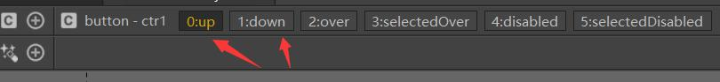

# 用FairyGUI控制器做东西
刚开始学这个感觉不知道哪里开始，索性去官方文档看了一下，感觉从控制器入手比较好（好个鬼）
>[官方文档链接](http://www.fairygui.com/guide/editor/controller.html)

## 控制器的作用、介绍
控制器用来批量控制视图（舞台）中的元件。相当于一个将一个视图中繁杂的元件分批打包，并且能够选择模式等。非常灵活方便。

如上图所示，你可以添加不同的页面来显示，并且可以选择按钮模板（目前还不知道作用），具体作用之后说，元件可以被分配到不同的页之中。

## 控制器的使用
先创建一个控制器，然后选择按钮模板。
当你创建完控制器，并且添加了页面后，你就可以将按钮与它绑定。按钮在上方菜单栏的资源处创建（创建的时候可以选择四个状态的图片）。

选中按钮后可以在属性控制下选择右边的加号添加要控制的属性，它已经帮你加了一个显示控制了（我们就用这个做一个例子）。

复制一个按钮，我们分别修改他们绑定的页面，并且让他们指向对方的页面。

然后通过点击按钮你发现它们被分配到了不同的页面

接下来我们使用按钮来切换页面。
选择页面0的按钮，修改它的“普通按钮”属性下的连接选项。切换到页面1，选择页面1的按钮，重复操作。

点击上方的三角符号运行，完成。

>这种控制器用来做背包、商城等需要分页的U很方便，同时可以批量控制一些属性