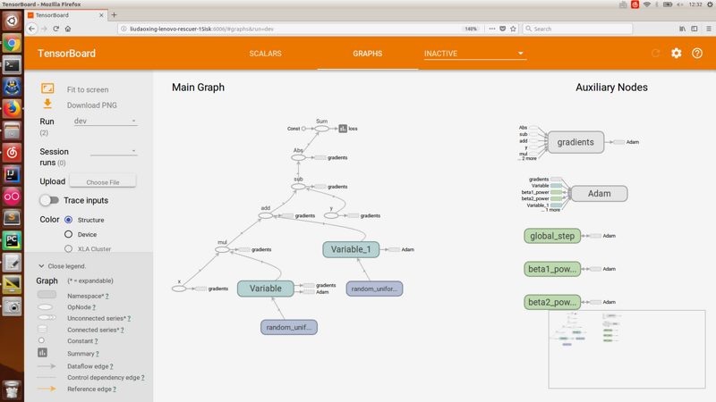

# Tensorflow基础语句及用法
>先大概了解怎么使用Tensorflow，然后通过边做边学的方式来进行有目的的学习是最有效的。

## Tensorflow的运作
Tensorflow顾名思义是`张量流动`的意思，这里的tensor虽然翻译成张量但其实跟向量没区别。
Tensorflow通过构建一张“图”，这个图有点类似“树”的结构。
***

***
这里可以看到图中有很多节点，我们输入的数据从根节点（就是最上方的节点）进入。然后流过这些节点。
因为数据一般是以张量的形式流过节点，所以叫它`张量流`。
这些节点是固定的，所以Tensorflow是静态图。

## 基本数据类型
### `tf.Variable()`（变量）
Variable是Tensorflow中的变量，通过tf.Variable(a)，（其中a是任意变量）可以将python中的任意（没记错的话应该是任意）数据变成Tensorflow中的变量。
变量的意义通过名字可以得知，就是可以改变的量。是主要的数据类型。

### `tf.placeholder()`（占位符）
占位符一般人可能没有听说过。它的作用很简单，就是用来填数据用的。如果这样说不理解可以先放着。

### 变量与占位符的结合
有了这两个数据类型之后，就可以实现一些基础的功能了。先放代码：
```
w = tf.Variable([2])
b = tf.Variable([1])
x = tf.placeholder(tf.float32, [3])
y = tf.placeholder(tf.float32, [3])

y_pre = w * x + b

loss = (y_pre - y)*(y_pre - y)
```

这段代码的前两行先定义了两个变量。第一行括号内的[2]是矩阵，这个矩阵的值被赋给w，所以w变成了[2]。
同理，b = [1]。

然后又定义了两个占位符，占位符用来接收输入。第一个参数是数据类型，都是32位的浮点数，第二个参数是描述输入的数据的形状的。
这里是一个一维的矩阵，注意！！！！：跟Variable不同的是，这里的3描述的是这个一维矩阵的长度。
所以x应该接收的是一个长度为3的一维矩阵，例如：[1,2,4]。

接着是一个等式，类似于我们中学做的拟合线性函数`y = w*x + b`，其中的w、b是未知量。
需要我们通过不断输入点(x, y)来计算他们的方差，最后计算出误差最小的w、b。代码中的loss就是方差。

>总结：变量在Tensorflow中作为待优化的量，占位符则负责接收输入的数据。

## 优化器
刚才我们利用线性拟合来理解变量和占位符，其中涉及到一个优化的概念。其实所谓的优化就是不断调整w、b的值，
使得最终的函数`y = w*x + b`能够正确预测输入的x对应的y。

在Tensorflow中，有一类函数可以用来替代我们手工优化的过程，那就是“优化器”。