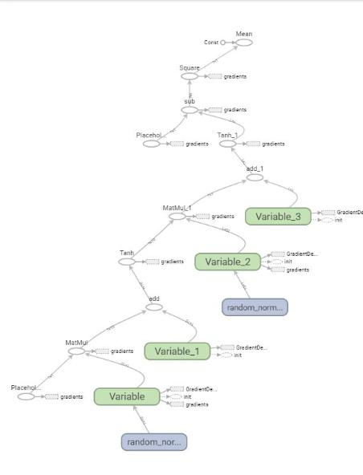

# Tensorflow基本概念

Tensorflow是用来进行深度学习训练的框架，集成了许多的接口函数，实现了高度的抽象化。大大方便了模型的建立。
节省了大量“造轮子”的时间。

## Tensorflow中的数据
深度学习本质上是一种概率统计的手段，需要大量的数据。在Tensorflow中，数据是以Tensorflow内置的类型Tensor的形式
存在。Tensor（翻译过来叫做张量）其实就是数组。比如十张100X100的彩色图片，可以变成[10,100,100,3]的数组（理解不了的好好学一下编程语言）。

---
Tensorflow中的Tensor数据类型可以大致分成两种，一种是我们要训练的数据，另一种是参数。比如我们有许多的点，
(x1, y1), (x2, y2)·····，我们需要拟合这些点，如果用线性函数的话就是`y = k*x + b`，那么k、b就是参数。
我们计算求导，然后调整参数，最后让我们的函数逐渐拟合这些数据。深度学习其实就是函数拟合的复杂版本。

## Tensorflow中的参数初始化
有些人天生就看起来聪慧一些，有些人则有些木讷。我们一般认为是人的基因导致的。如果将参数比作基因的话，
参数的初始化就是就是基因的初始化。如果一开始我们的模型有良好的参数，也就意味着我们的模型会想聪明的学生一样能够快速地学会正确的特征。
那么相对于初始化参数较差的模型，就会学的比较费劲。所以参数的初始化就显得尤为重要。

## Tensorflow中参数的优化
模型的训练就是参数的训练，就是一个不断拟合“正确值”的过程。令参数往正确方向靠拢的工具就是优化器。
Tensorflow中有写好的优化器。我们一般先计算好误差，然后通过求导、求梯度的方式一点点向正确的方向靠拢。

## Tensorflow是一张静态图

上图就是一个Tensorflow模型的结构，数据从入口进去，最后输出结果，形成了一张图。因为数据在图中流动，
所以得名“Tensorflow”。说它是静态的是因为它不可更改，你写好之后运行，你的模型就固定了。与之相对应的是Pytorch的
动态模型。

>学习这些新东西最好还是要有兴趣，兴趣才能推动一个人前进