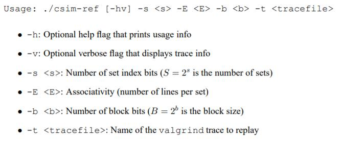

# CacheLab实验
>这是一个模拟缓冲访问的实验（虽然我没看懂题目要求）。

因为英文看着费劲，所以在网上找了一些解释。这个星期就慢慢研究一下吧。

>实验要求：模拟缓存工作，要根据输入的指令和数据输出命中率等信息（看完了整个实验的要求，仍然一头雾水，谁写的实验介绍啊）

## 内存单元包含内容
这里用一个结构类型记录内存的信息
```
struct line{
	int valid;//表示这块内存行内有没有数值存放
	int time;//表示多久没有使用
}
```

## 预先设置参数
有一些变量全局都需要使用，所以提前定义；
```
int s, v = 0, e, b;
long S;
struct line *cache[];
```
## 接收参数
因为需要接收参数，所以需要给main函数加入参数，形如：
```
int main(int argc, char* argv[])
{
	····
	return 0;
}
```
>网上找了一些其他的资料，发现也有用getopt()这个函数的，需要包含“getopt.h”这个头文件。因为没用过而且看起来很麻烦就用上面的方法吧

## update函数
在每次调用操作函数之前，都需要调用update将内存行结构体里的time+1；
```
void update(){
	int i;
	for(i = 0;i < S;i++){
		int j;
		for(j = 0;j < e;j++){
			cache[i*e+j].time++;
		}
	}
}
```

## Load函数
Load是读取内存，如果对应的内存没有值，即valid==0，那么就hits++，并且再将它的valid重新置为1。
```
void Load(long addr){
	update();
	long mask = 0;
	mask = ((~mask)<<(s+e))|(~((~mask)<<e));
	long set = addr&mask;
	mask = 0;
	mask = ~((~mask)<<(e+s));
	long tag = mask&addr;
	if(cache[set*e+tag].valid==0){
		if(v)
			printf("miss\n");
		misses++;
		cache[set*e+tag].valid=1;
		cache[set*e+tag].time=0;
	}
	else{
		if(v)
			printf("hit\n");
		hits++;
		cache[set*e+tag].time=0;
	}
}
```

## Store函数
```
void Store(long addr){
	update();
	long mask = 0;
	mask = ((~mask)<<(s+e))|(~((~mask)<<e));
	long set = addr&mask;
	mask = 0;
	mask = ~((~mask)<<(e+s));
	long tag = mask&addr;
	if(cache[set*e+tag].valid==1){
		if(v)
			printf("miss\n");
		misses++;
		int i, t = 0;
		for(i = 0;i < S;i++){
			int j;
			for(j = 0;j < e;j++){
				if(cache[i*e+j].valid==0){
					t = 1;
					cache[i*e+j].time=0;
					cache[i*e+j].valid=1;
					goto A;
				}
			}
		}
		A:;
		if(t){
			if(v){
				printf("evition\n");
			}
			int time = 0;
			for(i = 0;i < S;i++){
				int j;
				for(j = 0;j < e;j++){
					if(cache[i*e+j].time>cache[time].time){
						time = i*e+j;
					}
				}
			}
			cache[time].time = 0;
		}
	}
	else{
		if(v)
			printf("hit\n");
		hits++;
		cache[set*e+tag].time=0;
	}
}
```

## 参数判断
根据它给出的范例文件‘csim-ref’，我们需要模仿这个文件进行输入输出。这个文件支持-h、v、E、s、b、t等一系列操作。
除了h、v之外，其他操作都带有后续的参数。这里贴上原文描述：
那么就需要构建一个判断语句，这里我采用switch，然后要将传入的参数字符串中的数字部分转换成整型保存。

首先是读取文件中的操作参数，格式如下：op address,size。其中op是操作类型，address是地址，size是操作空间大小。
那么就用如下方法读取：
```
while(!feof(fp)){
	char op;
	int size;
	long addr;
	fscanf(fp, "%c %x,%d", &op, &addr, &size);
	if(v)
		printf("%c %x,%d", op, addr, size)
	if(op == 'I'){
		continue;
	}
	else if(op == 'M'){
		Modify(addr);
	}
	else if(op == 'L'){
		Load(addr);
	}
	else{
		Store(addr);
	}
}
```