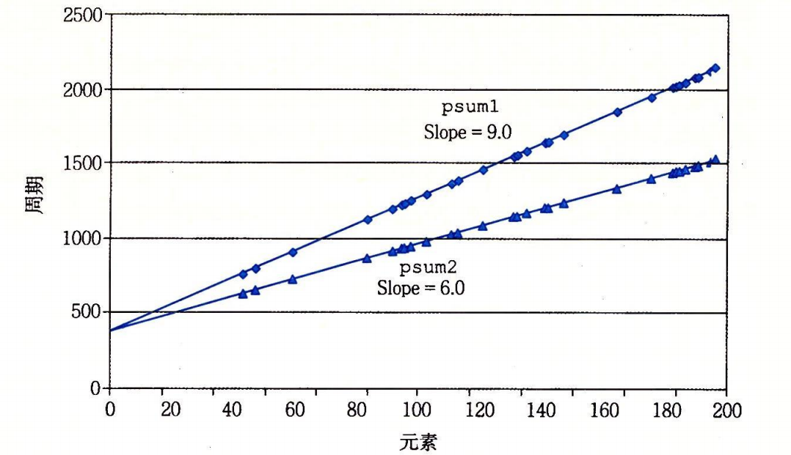
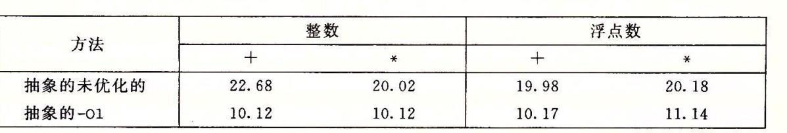

# 3.11
---
## 编译优化
虽然编译器会优化程序员的代码，像gcc还提供了优化等级。但是采用更好的方式写出的代码，
会比更高编译器最高等级的优化得到的效果要更好。

需要注意的是，编译器的优化是安全的优化。即所有的优化都要保证程序的行为不变。
当出现一些难以判断的操作，比如指针，编译器就难以优化代码。
```
void cal1(int *xp, int *yp)
{
	*xp += *yp;
	*xp += *yp;
}
void cal2(int *xp, int *yp)
{
	*xp += 2 * *yp;
}
```
以上两个函数，在指针指向的地址不同的时候会有同样的结果，即地址xp里的值变成原来的两倍。
但是如果指针指向的地址一样，那么第一个函数就会将xp里的值变为四倍，而第二个函数将xp里的
值变成三倍。

对于一般函数编译器不会去优化，不过内联函数编译器会进行优化。
	
# 3.14
---
循环展开相对于非循环展开花费指令周期较短：
```
void cal1(float a[], float p[], int n)
{
	int i;
	p[0] = a[0];
	for(i = 1;i < n;i++)
	{
		p[i] = p[i - 1] + a[i];
	}
}

void cal2(float a[], float p[], int n)
{
	int i;
	p[0] = a[0];
	for(i = 1;i < n - 1;i += 2)
	{
		p[i] = p[i - 1] + a[i];
		p[i + 1] = p[i] + a[i + 1];
	}
	if(i < n)
		p[i] = p[i - 1] + a[i];
}
```


书中接着给出了不同数据类型的运算效率，同样是进行上述代码的计算。