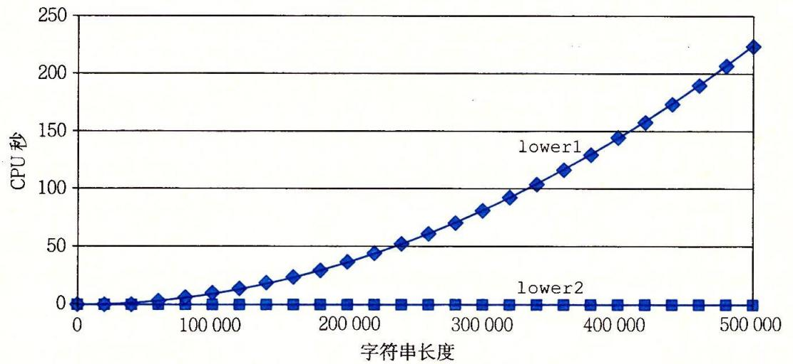
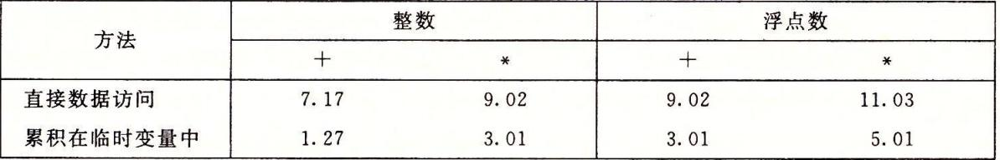
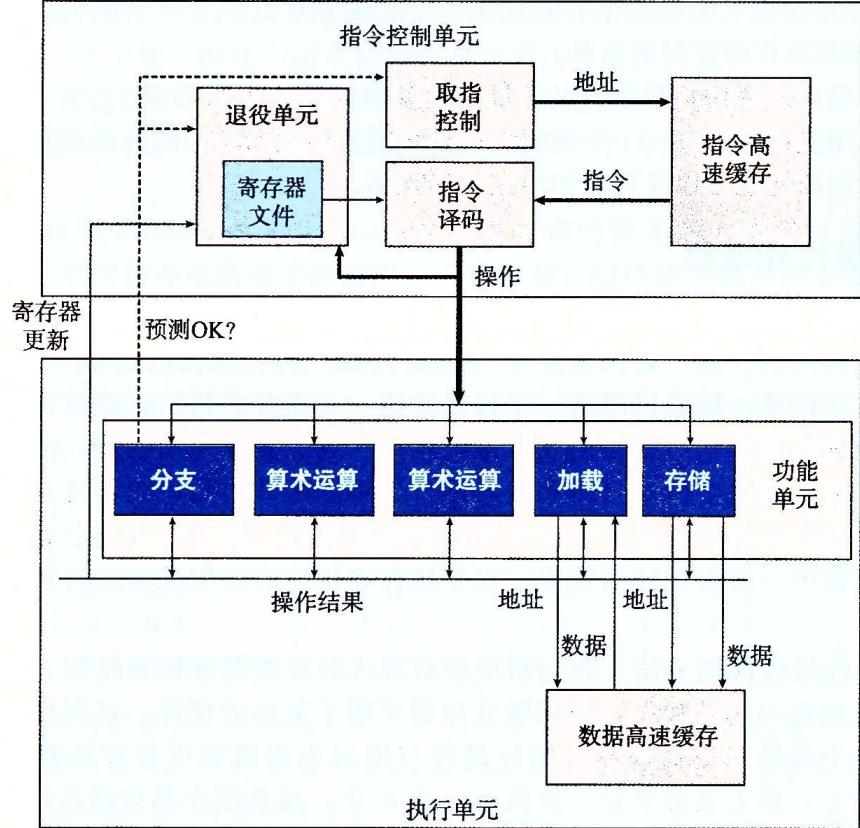
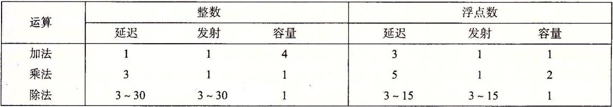

# 3.11
---
## 编译优化
虽然编译器会优化程序员的代码，像gcc还提供了优化等级。但是采用更好的方式写出的代码，
会比更高编译器最高等级的优化得到的效果要更好。

需要注意的是，编译器的优化是安全的优化。即所有的优化都要保证程序的行为不变。
当出现一些难以判断的操作，比如指针，编译器就难以优化代码。
```
void cal1(int *xp, int *yp)
{
	*xp += *yp;
	*xp += *yp;
}
void cal2(int *xp, int *yp)
{
	*xp += 2 * *yp;
}
```
以上两个函数，在指针指向的地址不同的时候会有同样的结果，即地址xp里的值变成原来的两倍。
但是如果指针指向的地址一样，那么第一个函数就会将xp里的值变为四倍，而第二个函数将xp里的
值变成三倍。

对于一般函数编译器不会去优化，不过内联函数编译器会进行优化。
	
# 3.14
## 循环优化
---
循环展开相对于非循环展开花费指令周期较短：
```
void cal1(float a[], float p[], int n)
{
	int i;
	p[0] = a[0];
	for(i = 1;i < n;i++)
	{
		p[i] = p[i - 1] + a[i];
	}
}

void cal2(float a[], float p[], int n)
{
	int i;
	p[0] = a[0];
	for(i = 1;i < n - 1;i += 2)
	{
		p[i] = p[i - 1] + a[i];
		p[i + 1] = p[i] + a[i + 1];
	}
	if(i < n)
		p[i] = p[i - 1] + a[i];
}
```

---
书中接着给出了不同数据类型的运算效率，同样是进行上述代码的计算。


可以看出，运用了优化选项-o1后的代码效率更高，应尽量使用-o1或者以上的优化。
另一方面的优化方法是尽量避免在循环中进行不改变值的操作，最常见的如`for(int i = 0;i < strlen(s);i++)`
此句中的`strlen(s)`函数会导致巨大的性能浪费。应该将`strlen(s)`移除循环，用常数代替。

---

另一种巨大的开销是反复的内存读取。在循环中如果进行类似`a[i] = p[i] + 1;`的操作，计算机每次操作都要在内存中读取数组的值。
内存的读取是比较慢的。而如果声明一个临时变量，这个临时变量会被储存在寄存器中，速度相对会快很多。
如：
```
float b;
for(int i = 0;i < len;i++)
{
	b = p[i] + 1;
}
相比
for(int i = 0;i < len;i++)
{
	a[i] = p[i] + 1;
}
更高效
```


# 3.30
## 指令执行
在cpu处理指令的时候，一条指令比如会被分成多步执行。比如addq %rax %8(rdx)会被分成1、从内存中取值到处理器；
2、将加载的值加上寄存器rax中的值；3、将结果存在内存中。

处理器中有退役单元。在一条指令分支确定已经正确执行后，有关于这条指令的信息会更新到对应的寄存器中；而如果这条指令的分支预测错误，
那么对应的信息会被清理。这个应该就是处理器的预测机制，提高执行效率。

## 功能单元

从图中蓝色部分可以看出，处理器中有一些负责运算的功能单元。


图中，延迟是指令的执行时间，发射是两条指令间的间隔，容量是可以执行此种操作的个数。
可以看到，除了除法以外，其他指令的发射时间都是一个时钟周期。这意味着当前指令执行完毕后立刻就可以执行下一条指令。这就是流水线执行。
指令之间互不影响。

出发的发射时间与它的延迟一致，意味着在下一个指令开始前，除法必须完成。