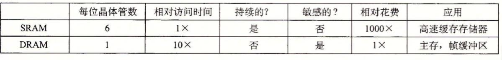
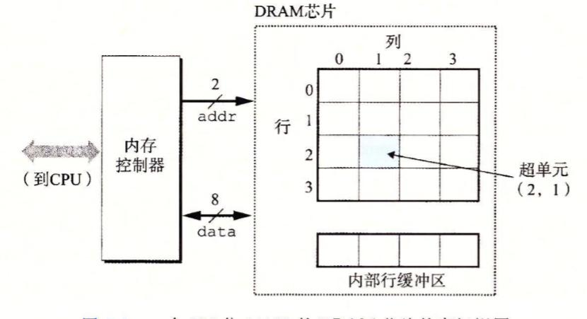
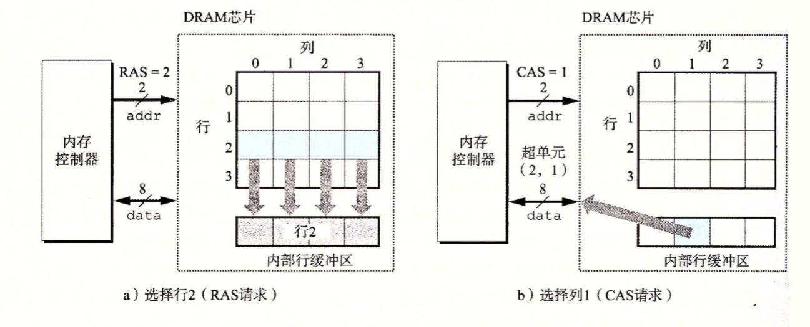

# 存储器层次结构
>因为要做cachelab的实验，先提前看这章内容，感觉干活还是比较多的

## 随机访问存储器
随机访问存储器分为静态、动态。静态的比动态的读写速度要快.静态的存储器一般用于高速缓存；动态的一般用来做主存或者显卡的帧缓冲区（也就是显存）。

### 静态RAM(SRAM)
静态RAM的特点是双稳态。它使用的是六角晶体管结构。
意思是它能够非常稳定得保持两个状态，要么是状态A，要么是状态B。所以只要一直通电，它就能保持状态且不怕干扰的。

### 动态RAM(DRAM)
动态RAM则是采用电容存储。电容非常小，而且容易受到干扰而漏电，在10-1000毫秒内就会失去电荷。不过计算机的周期通常为几纳秒，
相对而言储存的时间比较长。因此，它需要间隔一段时间就重新写入或者说充电。有些动态RAM可能会采用纠错码，
比如用74位的大小去记录64位的数据，这样就能发现其中的错误并纠正。

下面用一张图来总结两者特性及区别

## 传统的DRAM
DRAM芯片中分成d个超单元，每个超单元由w个DRAM单元组成

这里展示的是16x8的DRAM芯片。图中的小方格就是超单元，每个超单元有8位。
DRAM芯片通过引脚与内存控制器电路连接，每个引脚传输一位的数据。
图中由八个data引脚，负责传输一个超单元的信息。两个addr引脚传输超单元的行、列信息。

当读取一个超单元的信息的时候，内存控制器通过addr发送一个行坐标，然后DRAM芯片将整行的数据复制到内部行缓冲区。
接着再发送一个列坐标，然后内存缓冲区将对应的超单元的8位通过data发送到内部行控制器。

## 增强的DRAM
这节主要是关于如何提高DRAM的读写速度。总结一下就是在时钟控制、行缓冲区的读写，并行性上做功夫。目前最流行的是DDR SDRAM。

## 非易失性存储器
相对于RAM这种断电就失去信息的存储器，在断电后仍然能够保存信息的就是非易失性存储器。
只读存储器（ROM）是比较基础的，它衍生出了：

1、可编程只读存储器（PROM），采用熔丝，只能用电流熔断一次；

2、可擦写可编程ROM（EPROM），这个比较高端，有个石英窗口，紫光透过可以令EPROM单元被置为0。至于令单元置1就用一种特殊的设备。
可编程的次数达到1000次。

3、电子可擦除PROM（EEPROM），可以直接在印制电路卡上编程，与前两者的重大区别。可编程次数可以达到10^5次。

4、闪存（flash memory），是目前应用最广泛的，无处不在，各种电子设备都依赖于它。据观察U盘就是闪存。
固态硬盘就是基于闪存的一种磁盘驱动器。

存在ROM中的程序通常称为固件，系统通电后首先运行固件中的程序。一些系统会在固件中存一些输入、输出函数。
像PC依赖于固件中的程序翻译CPU的输入、输出请求。

## 访问主存
